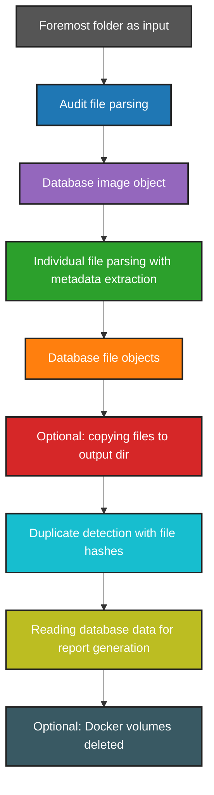

# Architecture


## Purpose

This tool serves as automated helper tool to investigate files carved by Foremost. It takes in a Foremost output directory, extracts the metadata for all files, looks for duplicate files based on hashes and creates a detailed report.

## Design

The main components of the tool are:

- **starting script**
- **PostgreSQL database image**
- **Python parser container**

> [!NOTE]
>
> The app's containers are run with Docker Compose.

The **starting script** takes in the parameters and sets environment variables and the database password if not set. It then starts the Docker compose containers.

The **Python container** reads and verifies the environment variables and creates the database.

Next, it parses the Foremost **audit file** and extracts general information about the Foremost scan - which is stored as a database object - and the carved files. Subsequently, it reads in every **carved file** and runs Exiftool on it. 

> [!NOTE]
>
> First, the tool tries to run Exiftool on batches of files. If a batch reading fails, every file of the batch is tried individually.
> The file(s) that cannot be read by Exiftool are then parsed with Python as fallback which is marked for the respective file.

The tool then creates a database object for every file, including calculated file hash. 
If the tool option `--with-images` is set, it proceeds with **copying supported files** to the report output directory. 

Once all files were parsed, the tool runs the **duplicate detection**, using a separate database table with all file hashes stored to improve performance. 

Duplicate detection can be performed within one image or across stored images, depending on startup options. 
For the **intra-image duplicate detection**, the tool reads all file hashes for the current image and creates a list of unique hashes with the file IDs associated to the hash. It then creates the duplicate group and member database objects. 

> [!NOTE]
>
> **Cross-image duplicate detection** is not yet implemented.

Finally, the tool reads all relevant data from the database and creates **report data** objects that can be used to render reports in different formats.

If `--store` is set, the data in the database is kept. Else, the starting script deletes all Docker volumes after the parser finishes.

### Module Structure

The tool root directory contains the starting script, the Docker compose file and detailed information about the tool.

```
src/
```

The `src/` directory contains the Python container configuration and source code files. 
This encompasses the `Dockerfile` for the Python container along with the `requirements.txt` to install necessary dependencies.

The Python code can be found in `app/`. Detailed information for this can be found in the [docs](./docs/html/index.html). It contains the following folders:

- `crud/` contains the database queries
- `models/` contains the database tables
- `parser/` contains the parser logic
- `report` contains the report generation logic

> [!NOTE]
>
> The `template/` folder will be used for future HTML reports.  

```
db/
```

The `db` directory contains the password file for the database which is generated on the first run.

```
docs/
```

The `docs/` directory contains the HTML documentation for the tool with `index.html` as start page.

````
resources/
````

The `resources/` directory contains resources and assets like the tool's logo.

### Data Flow


